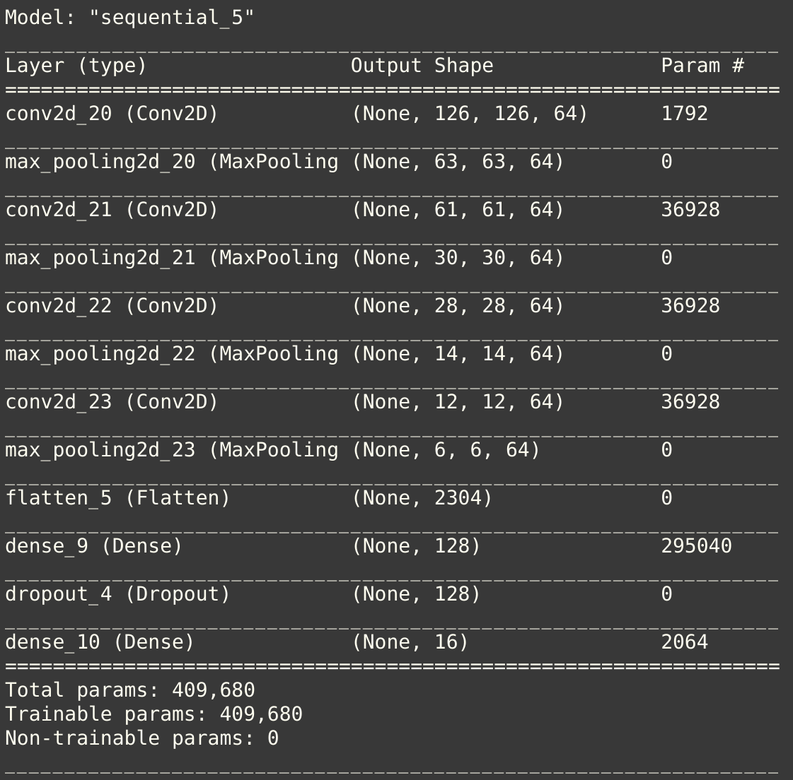

# The AI Calculator

A very basic calculator that understands handwritten math expressions and returns the evaluated answer.

The software translates basic handwritten arithematic equations to machine readable ones and evaluates them.

<code>NOTE: Works well with Marker/Sketchpen text on plain white sheet.</code>

## Pipeline

<ol>
    <li>Preprocess image</li>
    <li>Segment te equation into individual characters.</li>
    <li>Predict each segmented character using a custom CNN</li>
    <li>Evaluate the final expression</li>
</ol>

## CNN model

A basic CNN with 3 sets of CNN layers and 2 Dense layers having a total of approximately 410,000 parameters.

- The model was trained with 7315 training images and 1252 validation images (Thanks to [clarence zhao](https://www.kaggle.com/clarencezhao) for the [dataset](https://www.kaggle.com/clarencezhao/handwritten-math-symbol-dataset)).

- The model achieved a training accuracy of 97% with a training loss of 11%, and validation accuracy of 98% with 9% validation loss and was trained for 20 epochs.

## Working

- The algorithm takes in an image of any size and performs character segmentation using openCV
- Individual characters undergo character prediction using the CNN model.
- Based on number of consecutive numbers detected, the algo creates either an n-digit number and performs the specified operation.

  ### Input image:

  

  ### Output Image:

  

## Improvements Needed

- Much better dataset with lot of variation
- Better character segmentation
